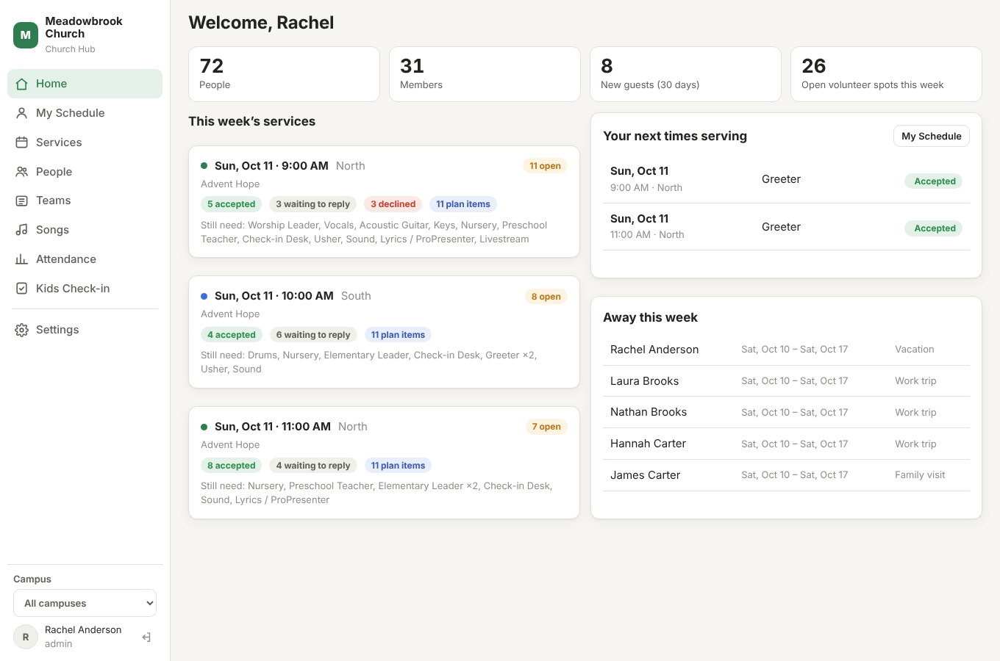
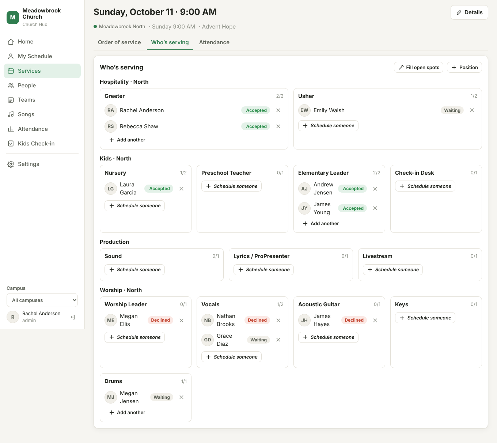
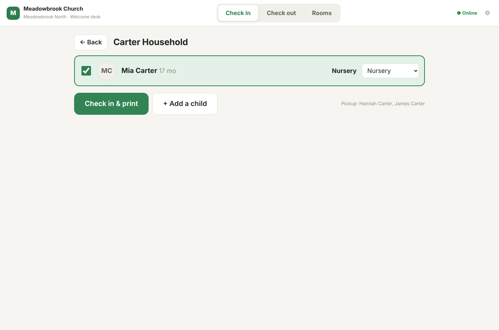

# Meadowbrook Church Hub

One system for running Meadowbrook Church across all of our campuses: people and families,
service planning, volunteer scheduling, attendance and kids' check-in today, with discipleship,
team chat, the website/app and giving to follow. It replaces Faith Teams, Google Chat, Subsplash
and our discipleship tracking, one phase at a time.

It is a web app. Staff use it on a computer, volunteers on their phones, and the welcome desks
on tablets. Everyone signs in with a Google account (church or personal).



| | |
|---|---|
|  |  |

<sub>Screenshots from `npm run demo`, which uses made-up people.</sub>

## Roadmap

| Phase | What it covers | Replaces | Status |
|---|---|---|---|
| **1. People & planning** | People and households, campuses, teams, service plans and songs, volunteer scheduling, attendance, kids' check-in with name tags | Faith Teams | **Built** |
| 2. Discipleship | Growth pathway and next steps, mentor pairs with meeting logs, small groups, new-guest follow-up | (new) | Next |
| 3. Team communication | A chat for every team plus groups, with photos, files, replies, reactions and @mentions; tasks with due dates, reminders, checklists and comments | Google Chat | **Built** |
| 4. Website & member app | Public website, sermons, events, connect forms, an installable member app | Subsplash | Planned |
| 5. Giving | Online giving with Stripe, funds, year-end statements | Subsplash Giving / Faith Teams giving | Planned |

## Try it (no setup needed)

You need [Node.js 22.13 or newer](https://nodejs.org).

```bash
npm install
npm run demo
# open http://localhost:8090
```

The demo fills a separate database (`data/demo.db`) with **made-up** families, two campuses,
teams, songs, services and six weeks of attendance. Sign in with any of these (no password in
demo mode):

| Email | Access |
|---|---|
| `pastor@meadowbrook.church` | Admin, all campuses |
| `south@meadowbrook.church` | Staff, South campus only |
| `volunteer@meadowbrook.church` | Volunteer, sees their own schedule |

## What's in Phase 1

**Home**: this week's services at each campus, open volunteer spots, who's declined or not yet
replied, who's away, and your own next times serving.

**People**: everyone, in households. Search by name, email or phone. Each person shows their
family, the teams they serve on, their schedule, and kids' check-in history. Includes allergies
and medical notes, authorized pickup people, photos, duplicate detection and merging, and CSV
export.

**Profile fields**: track milestones and growth on each person's profile: check marks for
**Baptized in Jesus' name** and **Filled with the Holy Ghost**, **Baptism date**, **Holy Ghost date**,
**Classes completed** and **Leadership track** to start with. Add your own fields in
**Settings → Profile fields**: dates, yes/no, steps, several choices, text or numbers, grouped into
sections, with optional staff-only visibility. Filter **People** by any field (for example
"Baptized in Jesus' name: Yes" or "Baptism date: no answer yet"). Imports fill them too: a CSV column
named like a field ("Baptism Date") maps to it automatically.

**Campuses**: every person, team, service time, kids' room and check-in belongs to a campus.
Staff can be limited to their own campus. The campus picker in the sidebar filters every page.
Adding a new campus is just **Settings → Campuses → Add campus**.

**Teams**: teams (Worship, Kids, Hospitality, Production…) with positions, and a roster grid of
who serves in which position: tick a box to change it. Add several people at once. Teams are
either per campus or church-wide. Team leaders can schedule their own team.

**Services**: a month calendar (or list) of every service at every campus. **New service**
creates a one-off service or a **repeating** one (every week, every 2 weeks…) with the positions
it needs, and the calendar fills itself in. When you change or delete a repeating service you
choose **just this one** or **this and all following**. The pencil and trash buttons in the
**Repeating services** list edit a whole series (time, length, title, end date, template, positions)
or delete it from a date on; past services and their attendance stay. Each service has:
- an **order of service**, laid out like Faith Teams: minutes, start–end time, type
  (Announcement, Song, Offering, Prayer, Message…), name with details, and who's leading. Add rows
  from the bar at the bottom; songs are found by typing a few letters, and new songs can be
  created there. Edit and delete buttons appear on the right of each row (deleting can be undone).
  Drag to reorder, copy from another service, or print. Mark a section **"the service starts
  here"** and the rows above it (huddle, countdown) count down to the start time.
- **Who's serving**: every team at the campus is listed (teams with nothing needed yet are dimmed); filter to one or more teams. *Schedule someone* lists only the people
  assigned to that position, best choices first: not away, not already serving at the same time
  **at any campus**, and not overused lately. **Fill open spots** does this for the whole service
  at once.
- **Templates** (Planning → Templates, staff only): reusable orders of service such as "Sunday
  Morning". Mark the rows that change each week (speaker, songs, announcements) as **Fill in each
  week**; on a service they show as *Needs filling* until someone fills them in, and the calendar
  marks services that still have empty slots. Start a new service from a template, use one on an
  existing service (**Use a template**), save a finished service as a template, or link a template
  to a repeating service so every new date arrives already laid out.
- **Lock**: staff can lock a service once it's final, so only admins can change its order of
  service and schedule. **Settings → Sign-in & accounts** also sets who can edit orders of service
  and who can schedule.
- **Attendance**: a **roll call** for the attendance team. Tap people (or **Mark family**) as you
  see them, on a phone or computer, and add new guests on the spot. Room headcounts are there
  too. The Attendance page lists who **hasn't been here in 3+ weeks** and **first-time guests**,
  and each person's profile shows their attendance history.

**Schedule** (Planning → Schedule): schedule a team a month at a time. Pick a repeating service
(e.g. North · Sunday 9:00 AM) and a team to see every position down the side and that month's
services across the top. Pick someone from the team list (it shows how often each person serves
that month and when they're away), then click open spots to place them, or drag them onto a
spot. **Fill the month** fills every open spot for that team, avoiding people who are away or
already serving then and giving people weeks off where it can. Click a name to see their reply
or remove them.

**Sending requests**: placing someone (by hand, Fill open spots or Fill the month) saves a
**draft**, marked *Not sent*, so you can move people around freely. When the schedule looks right,
**Send requests** (on the Schedule page or a service's Who's serving tab) shows who will be asked
for what, then sends each person **one** email and app notification listing all their spots,
with Accept and Can't-make-it buttons that work without signing in. Taking someone off after
they were asked sends them a short "no longer needed" note. Reminders only go to requests that
were sent.

**Access**: everyone starts as a volunteer. Ticking **Leader** for someone on a team gives them
leader access (to schedule their team); it goes back to volunteer when they no longer lead any
team, unless an admin chose their access by hand. Admins can change anyone's access from their
profile in People (**Change access**) or in Settings → Sign-in & accounts.

**My Schedule**: volunteers accept or decline (with a reason), mark dates they'll be away, and
open the order of service for anything they're on.

**The app and notifications**: anyone can put the site on their phone's home screen and use it
like an app (My Schedule shows how, step by step on iPhone). With notifications on, volunteers get
a notice when they're scheduled and can **Accept right from the notification**; *Can't make it*
opens the app to give a reason. They're reminded before they serve (two days ahead by default;
**Settings → Church → App**), and team leaders hear when someone declines. Everything also shows
under the bell at the top of every page. Each person chooses which notices they want. Admins can
set the app's icon and short name in **Settings → Church**. Notifications need no setup or
outside service: the server makes its own keys the first time. On iPhone, notifications work once
the app is added to the home screen (iOS 16.4 or later).

**The church app** (`app.yourchurch.org`, or `/app/` on any address): the app you share with
your congregation, like a Subsplash app. Anyone can use it without an account: the home screen,
service times and addresses, the livestream, giving, and a **connect card** for guests. Signing in
adds the person's serving schedule (accept/decline, dates away, the order of service for anything
they're on) and notifications. The Serve tab also has **All services**: a month calendar with
campus buttons, where anyone signed in can open any upcoming service to see its order of service
and who's serving (only requests that were sent, without contact details).
- **App Builder** (Church app → App Builder, staff): choose the tabs along the bottom (up to 5,
  including More), their names and icons, and build the home screen from **widgets** on a grid
  four squares wide: buttons, pictures (upload a graphic for an event or series), welcome banner,
  my serving, my tasks, service times, livestream and text. Right on the phone preview, drag a
  widget to move it and drag its corner to resize it (Small, Medium, Square, Wide, Large or Full,
  depending on the widget); tap one to change its words, icon, link, picture and look (white,
  tinted, brand color or any color). Add
  your own **pages** (beliefs, next steps…) and **links** (events, sermons, sign-ups). A live phone
  preview shows every change before you save. Set the livestream (YouTube links play in the app)
  and giving links here.
- **Events** (Planning → Events, staff): revivals, youth nights, potlucks… with a picture, place,
  campus and description. Published events show on the app's **Events** calendar (a tab you turn on
  in the App Builder, which also shows service times) and in an **Upcoming events** widget. Turn on
  **sign-ups** to collect RSVPs: how many are coming, your own questions (short answer, pick one,
  yes/no), a cap and a closing date. Set a **price per person** and people pay by card through your
  Stripe account (event payments are kept apart from giving). Everyone gets a confirmation email;
  the Sign-ups tab lists who's coming, exports a CSV, adds people who signed up by phone, and cancels
  or refunds.
- **Connect cards** (Church app → Connect cards): what guests send, with first-time visits,
  interests and prayer requests. Staff get a notification for each one. Add the guest to People
  (it checks for duplicates), link them to someone already there, and mark them followed up.

**Chat** (in the dashboard and the church app):
- **Every team has a chat.** Its members are the team roster: adding someone to the team adds
  them to the chat, and taking them off removes them. Staff can also open the team chats at their
  campuses (under "Other team chats").
- **Groups** for people who aren't one team (staff, elders, a project). Team leaders and staff
  make them and choose who's in; whoever made it can add or remove people, rename or delete it.
  Anyone can leave a group.
- **Photos and files** (up to 25 MB; photos are shrunk before they upload), **replies** to a
  message, **emoji reactions**, and **@mentions** (type @ and a name). Edit or delete your own
  messages; team leaders and group admins can delete anyone's.
- **Live**: open chats update as messages arrive. Everyone else gets a push notification (one
  per chat, replacing the last). **Mute** a chat to stop those, except when someone @mentions you.
  The Chat menu item and the app's chat button show unread counts.
- In the church app, the chat button is at the top of every screen once you're signed in. Staff
  can also turn on a **Chat** tab in the App Builder.

**Tasks** (in the dashboard and the church app):
- **Anyone on a team can give a task to anyone on that team**, and everyone can keep personal
  tasks just for themselves. Start one from **Tasks → New task**, or from any chat message (the
  ☑ button on a message makes it the task's title, for that team).
- Each task can have a **due date and time**, a **service** it's for, **notes**, a **checklist**,
  **comments**, and can **repeat** (every day, week, 2 weeks or month): ticking it off makes the
  next one, with the checklist unticked. Undo takes the next one back.
- **Lists**: My tasks (grouped Overdue, Today, Tomorrow, This week, Later), I gave out (to see how
  they're going), and Teams (every open task on your teams). Show finished ones from the last 60 days.
- **Notifications**: when you're given a task; "due tomorrow" the morning before and "due today"
  that morning (in the campus's time zone); and to whoever gave it, when it's finished or someone
  comments. The Tasks menu item shows how many of yours are due today or late.
- **In every chat**: a **Tasks** tab next to Messages lists everything still open for that team or
  group (grouped by when it's due), with what was finished this week underneath. Giving a task
  posts a **task card** in the chat that stays current: tick it off right on the card and it turns
  into "Done by Grace" for everyone. The ☑ button by the message box (or on any message) opens a
  quick sheet: what, who (tap a face), and when (Today, Tomorrow, Before the next service, or a
  date). Groups have their own tasks too, for the people in the group.
- **Notifications have buttons**: Done, or Tomorrow to push the due date back a day, without
  opening the app.
- In the church app: **More → Tasks**, a **My tasks** widget on the home screen, and an optional
  Tasks tab (App Builder).
- The person who gave a task, team leaders and staff can delete it.

**Video calls** (in every chat, in the dashboard and the church app; uses Daily):
- The 📹 button in a chat starts a call now (everyone in the chat gets a notification to join), or
  schedules a meeting: a card goes in the chat and everyone is reminded 15 minutes before. Join
  opens the call full screen inside the app or hub (camera, mic, screen share); **Open in browser**
  is there if a phone won't start the camera inside the app.
- Calls end on their own 5 minutes after everyone leaves. Whoever started a call (or the team's
  leaders) can end it for everyone or cancel a meeting.
- **Monthly limit** (Settings → Church → Video calls, 9,000 minutes to start): Daily's free plan is
  10,000 participant-minutes a month. The hub checks Daily's own usage every minute while calls
  are live (and on every join), shows it as a meter in Settings, and notifies admins at 80% and at
  the limit. Once the limit is reached, new calls can't start and calls going on end, until the 1st. Setup: see
  "Video calls (Daily)" under Going live.

**Giving** (Stripe):
- **Give** in the church app (and a public page at `/give` to link from the church website): an
  amount (or $25 / $50 / $100 / $250 / $500), a fund (grouped: Main, Missions, Special Offering),
  one time, weekly, every 2 weeks or monthly, and **cover the fee** (adds exactly enough that the
  church receives the full gift). Then Stripe's secure form opens in the page: card, **bank
  account**, **Apple Pay** or **Google Pay**. Card numbers go to Stripe, never through the hub.
  Guests give with a name and email (matched to People by email); signing in isn't needed.
- Every successful gift gets a thank-you email that serves as the receipt. Bank payments show as
  processing until they clear (a few business days).
- **My giving** (app → More): the year's total, every gift, and recurring gifts to change (amount
  or fund) or stop, plus a link to update the card or bank account (Stripe's page).
- **Finance permission**: only accounts with **Finance** ticked (Settings → Sign-in & accounts, or
  a person's *Change access*) see giving: the **Giving** page under Finance. Not even admins see who
  gave what without it. Finance → Giving has:
  - **Overview**: totals, gifts, givers, recurring per month, by fund, by method, by campus, by week,
    for this month / last month / this year / last year / any dates;
  - **Gifts**: every gift with search, fund filter and **CSV export**; link a guest's gifts to
    their People record;
  - **Cash & checks**: enter each offering as a batch (date, campus, label), one line per gift:
    a person (or "loose cash"), fund, cash or check (with check number) and amount; Enter adds
    the next line. Open a batch later to fix it, or delete it;
  - **Statements**: everyone who gave in a year, with totals; **View** a statement (print or save
    as PDF), **Email all** (each giver gets theirs; anyone already sent is skipped) or send one.
    Set the church's legal name, EIN, address, message and signature that go on every statement.
    Givers can also open their own from the app (More → My giving);
  - **Donors**, **Recurring**, and **Funds** (add, rename, reorder, hide, choose the default; set
    the cover-the-fee rate).

**Songs**: the song library with keys, CCLI numbers, and when each song was last used. Add
**chord charts, lyrics and sheet music** (PDF, picture or text) and **audio** (MP3, M4A, WAV) to a
song; they show as chips on that song in every service plan, in the hub and the app. Charts and
lyrics open, and audio plays right in the plan. Name a file for its key ("Way Maker - G.pdf") and
it's marked for G; files for the key being played come first.

**Attendance**: weekly headcount, kids checked in, and volunteers serving, per campus.

**Kids Check-in** (`/checkin`, for tablets at the welcome desk):
- Find a family by the last 4 digits of a parent's phone or by last name, tick the kids, and
  check in. Each child goes to the right room by grade or age, and you can override it.
- Prints a **name tag** for each child (name, room, allergy warning, pickup code) and a
  **parent pickup tag** with the same code.
- **Check out** by typing the code from the parent's tag. It shows who is allowed to pick up.
- **Rooms**: a live list of who's in each room, with allergies.
- **Works offline.** The tablet keeps a copy of the family list. If the internet drops, it keeps
  checking kids in and printing tags, then uploads everything when the connection returns,
  never counting anyone twice.
- New families and children can be added right at the desk (needs internet).

## Going live

We run one server in the cloud so every campus reaches it the same way, and a power cut or
internet outage at one campus never takes down another. A small server is plenty: 1 CPU, 1 GB
memory, about $6–25/month.

### 1. Google sign-in

Do this once, signed in as a Google Workspace admin:

1. Go to [Google Cloud Console](https://console.cloud.google.com) → create a project called
   "Church Hub".
2. **APIs & Services → OAuth consent screen** → choose **External**, so volunteers can sign in
   with personal Gmail accounts too, then **Publish app** (Audience → *In production*). The hub
   only asks for name and email, so Google doesn't require a review. Pick **Internal** instead
   only if everyone will use a church Google account.
3. **APIs & Services → Credentials → Create credentials → OAuth client ID** → **Web
   application**.
   - Authorized redirect URI: `https://YOUR-ADDRESS/auth/google/callback`
     (for example `https://hub.meadowbrook.church/auth/google/callback`)
   - If the church app has its own address, add its callback too:
     `https://app.meadowbrook.church/auth/google/callback`
4. Copy the **Client ID** and **Client secret** into the settings below.

### 2. Settings

Copy `.env.example` to `.env` (or enter these in your host's dashboard):

```
PUBLIC_URL=https://hub.meadowbrook.church
MB_APP_URL=https://app.meadowbrook.church
GOOGLE_CLIENT_ID=...
GOOGLE_CLIENT_SECRET=...
GOOGLE_WORKSPACE_DOMAIN=meadowbrook.church
MB_ADMIN_EMAILS=you@meadowbrook.church
```

`PUBLIC_URL` is the staff dashboard's address and `MB_APP_URL` the church app's (optional; without
it the app is at `PUBLIC_URL/app/`). Point both names at the same server: the address someone
visits decides what they see. Never set `MB_DEV_LOGIN` on the live server.

### Email (sign-in codes and passwords)

People who aren't using Google sign in with their email: the first time (or after forgetting
their password) the hub emails them a 6-digit code, then they choose a password. Everyone in
People with an email can do this and gets a volunteer account automatically; with **Who can
sign in → Anyone**, people new to the church can create an account in the app and are added to
People (listed under **Connect cards → App sign-ups** for staff to welcome).

To send those emails from the church's Google Workspace (free, about 2,000 a day):
1. Sign in to Google as the sending account (for example `web@mbclife.church`) and turn on
   **2-Step Verification** (Google Account → Security).
2. Still under Security, open **App passwords**, create one named "Church Hub", and copy the
   16-letter password.
3. Add these settings on the server, then redeploy:
   ```
   MB_SMTP_USER=web@mbclife.church
   MB_SMTP_PASS=the 16-letter app password
   MB_MAIL_FROM=Meadowbrook Church
   ```
   (Other email providers work too: also set `MB_SMTP_HOST` and `MB_SMTP_PORT`, using port 465.)

If your Workspace admin has turned off app passwords, allow them for that account in the Google
Admin console (Security → Authentication → 2-Step Verification).

### Video calls (Daily)

Calls in chats run on [Daily](https://www.daily.co). The free plan includes 10,000 participant-minutes
a month (one person on a call for one minute), and the hub stops calls at its own limit
(9,000 to start) so you stay on the free plan.

1. Sign up at **dashboard.daily.co** with the church's account (for example web@ your domain).
   Choose a team/subdomain name when asked, e.g. `mbclife`. You don't need a credit card for
   the free plan.
2. In the Daily dashboard, open **Developers** and copy the **API key**.
3. In Render, open the service → **Environment** → **Add Environment Variable**:
   `MB_DAILY_API_KEY` = the key. Save; Render redeploys.
4. In the hub, **Settings → Church → Video calls** should now say **Connected to Daily** and show
   minutes used this month. Change the monthly limit there if you like (0 turns calls off).
5. Try it: open a team chat, tap 📹 → **Start a call now**.

Keep the API key secret: only in Render's Environment, never in chat or in the code. If it's ever
exposed, delete it in Daily's dashboard and make a new one.

### Giving (Stripe)

Stripe has no setup or monthly fee: it keeps a small part of each gift (2.2% + 30¢ on cards with the
nonprofit discount, 0.8% capped at $5 for bank payments) and deposits the rest in the church's bank.

1. **Create the account** at **stripe.com** with the church's legal name, EIN and the bank account
   for deposits. In **Settings → Payment methods**, make sure **Cards**, **ACH Direct Debit** (US bank
   account), **Apple Pay** and **Google Pay** are on.
2. **Nonprofit discount**: follow Stripe's "Fee discount for nonprofit organizations" support page
   (EIN or 501(c)(3) letter). Then set the same rate under Finance → Giving → Funds → Cover the fee.
3. **Keys**: Stripe dashboard → **Developers → API keys**. In Render → Environment add
   `STRIPE_PUBLISHABLE_KEY` (starts `pk_live_`) and `STRIPE_SECRET_KEY` (starts `sk_live_`).
4. **Webhook** (how Stripe tells the hub a gift went through): Developers → **Webhooks → Add
   endpoint**. URL: `https://<your Render address>/stripe/webhook`. Events:
   `checkout.session.completed`, `checkout.session.async_payment_succeeded`,
   `checkout.session.async_payment_failed`, `payment_intent.succeeded`,
   `payment_intent.payment_failed`, `invoice.paid`, `invoice.payment_failed`,
   `customer.subscription.updated`, `customer.subscription.deleted`, `charge.refunded`.
   Copy its **Signing secret** (starts `whsec_`) into Render as `STRIPE_WEBHOOK_SECRET`.
5. **Apple Pay**: Settings → Payment methods → **Payment method domains** → add your Render address
   (and app.mbclife.church later, if you move the app there).
6. **Updating cards**: Settings → Billing → **Customer portal** → turn it on (lets givers change the
   card or bank account on a recurring gift).
7. Give **Finance** access to whoever handles giving (a person's *Change access*).
8. Try it with Stripe's **test mode** keys first (`pk_test_`/`sk_test_`, card 4242 4242 4242 4242),
   then switch to the live keys.

Keep the secret key and webhook secret only in Render.

### 3. Run it

The repo includes a `Dockerfile`. Any host that runs Docker with a **persistent disk** mounted at
`/data` works, for example:
- **A small VPS** (DigitalOcean, Linode, Hetzner): install Docker, then
  `docker build -t church-hub . && docker run -d --restart=always -p 8090:8090 -v /srv/church-hub:/data --env-file .env church-hub`,
  and put [Caddy](https://caddyserver.com) in front for automatic HTTPS
  (`hub.meadowbrook.church { reverse_proxy localhost:8090 }`).
- **Render, Railway or Fly.io**: create a web service from this repo, attach a disk at `/data`,
  and add the settings above.

Without Docker: `npm ci --omit=dev && npm start`.

On Render, Railway or Fly.io, set `MB_TRUST_PROXY=1` so the app knows it is behind their HTTPS
proxy. Elsewhere, set it to the proxy's address if the proxy isn't on the same machine or
private network.

### 4. Backups

Everything lives in one database file plus an `uploads` folder of photos. `npm run backup`
saves a safe copy while the server is running and keeps the last 30. Run it daily (for example
with cron: `15 3 * * * cd /app && npm run backup`), and copy `data/backups` somewhere off the
server, such as a Google Drive folder or your host's snapshot feature.

### 5. First-time setup

1. Sign in with an admin email.
2. **Settings → Church**: confirm the name and pick your brand colour.
3. **Settings → Campuses**: add each campus.
4. **Settings → Import people**: export your people from Faith Teams as CSV and import it. Run a
   **test import** first. Re-importing updates people rather than duplicating them, so you can
   keep Faith Teams running alongside until you switch over.
5. **Teams**: create teams and positions, and add members.
6. **Templates**, then **Services → New service**: build a template for your usual order of
   service, then add your regular services as repeating services that start from it, with the
   positions each one needs.
7. **Settings → Check-in & attendance**: pick your label printer and add kids' rooms with their
   age or grade ranges.
8. **Settings → Sign-in & accounts**: give staff and team leaders the right access. By default
   anyone with a Google account can sign in and starts as a volunteer, who sees only their own
   schedule. **Who can sign in** can limit this to people in the directory, church accounts, or
   invited accounts only.

### Check-in tablets and printers

- Any iPad, Android tablet or laptop with a modern browser works. Open `/checkin`, sign in with
  a **leader** account, choose the campus and a station name, and leave it signed in.
- Label printers that work well from a browser: **Brother QL-810W/820NWB** with DK-1209
  (62 × 29 mm) labels, or **DYMO LabelWriter 450/550** with 30252 labels. Pick the size in
  Settings → Church.
- For printing without a print dialog, use the tablet's kiosk or "silent printing" option where
  it has one (for example, Chrome's `--kiosk-printing` on a laptop).

## Who can do what

| | Volunteer | Leader | Staff | Admin |
|---|:-:|:-:|:-:|:-:|
| Own schedule, accept/decline, away dates | ✓ | ✓ | ✓ | ✓ |
| Order of service for services they serve at | ✓ | ✓ | ✓ | ✓ |
| See people, teams, all services; run check-in; add new families | | ✓ | ✓ | ✓ |
| Chat with their teams and groups | ✓ | ✓ | ✓ | ✓ |
| Start chat groups | | ✓ | ✓ | ✓ |
| Give tasks to people on their teams; keep personal tasks | ✓ | ✓ | ✓ | ✓ |
| Schedule their own teams, edit orders of service | | ✓ | ✓ | ✓ |
| Edit people, services, rooms; schedule any team | | | ✓ | ✓ |
| Settings, campuses, accounts, import, merge duplicates | | | | ✓ |

Any account can be limited to some campuses.

## For developers

- Node.js 22.13+, Express, and SQLite through Node's built-in `node:sqlite`, so there is
  nothing native to compile. The front end is plain JavaScript modules with no build step.
- `server/`: `db.js` (schema and migrations), `auth.js` (Google sign-in, sessions, roles),
  `routes/` (one file per area).
- `public/`: `app.html` + `js/app.js` (shell and router), `js/pages/*` (one per page),
  `checkin.html` + `js/checkin.js` (the tablet app). `js/checkin-rules.js` is shared by the
  server and the tablets.
- Database changes go in a **new** entry at the end of `MIGRATIONS` in `server/db.js`. Never
  edit one that has shipped.
- `npm run dev` runs with test sign-in and auto-restart. `npm test` runs the test suite.
- Every API change requires the `x-mb: 1` header, which blocks cross-site request forgery.
